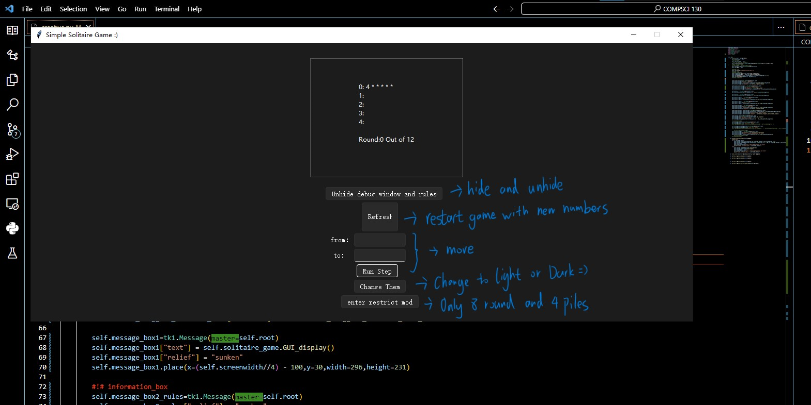
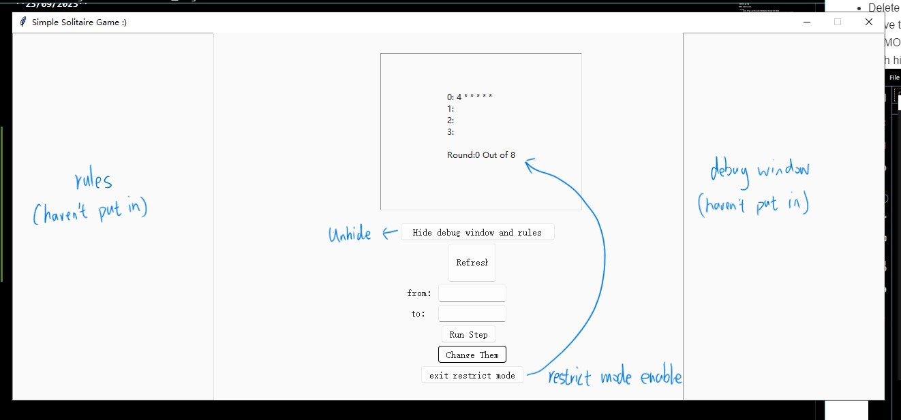

creative.py log

Other library uses:

- sv_tty
    - Link: https://github.com/rdbende/Sun-Valley-ttk-theme
    - Liences: https://github.com/rdbende/Sun-Valley-ttk-theme/blob/main/LICENSE

**19/09/2023**
- [x] first upload to github

**19/09/2023 later same day**
- [x] Appframe
    - [x] three button reserved for future .
    - [x] Messagebox "message_box1" connected and display content from "Solitaire", add new function "play_new" in "Solitaire" to return the piles of numbers to the Messagebox.
    - [TODO] Change color of text based on the app theme.

**19/09/2023 later same day** 
- <del>I've got some idea on how to change color of text while changing theme, in module sv_ttk(the theme module that i am using to make it looks better from github) there is a function "sv_ttk.get_theme()" which can return the current color theme. That sounds great but I don't know how to refresh the color of text after "sv_ttk.get_theme()" return a new color. So I decide to start with dark theme first, I will probably improve this later</del>
- nvm I was thinking too complex, its easy to change color of text while changing theme and I have used it in the button already 

**19/09/2023 later same day** 
- Changed the whole theme to "Sun-Valley-ttk-theme"
-----------------------------

**23/09/2023** 
- The based function of the game has already done, including: 
  - [x] Display current states of game
  - [x] User can move numbers around the piles according to the rule
  - [x] User can win or lost after specified round
  - [x] User can change color now to light or dark with higher visibility
- These are not / still debugging:
  - [TODO] Change the difficulty of the game based on changing the times of try
  - [TODO] Fixed-length randomized arrays to improve playability
  - [TODO] improve to some detailes

**29/09/2023** 
- I changed the date, some of the past log have a wrong date
- Successfully add the support of changing difficulty
- Successfully add Fixed-length randomized arrays to improve playability by using random
- The game can restart now !
- Delete some piece of code that I never used, improved grammer
- Move the process of collecting number list from draft.py to creative.py
DEMO:
With hidden debug window and rules window:

Without hidden debug window and rules window + light theme + restrict mode:
 